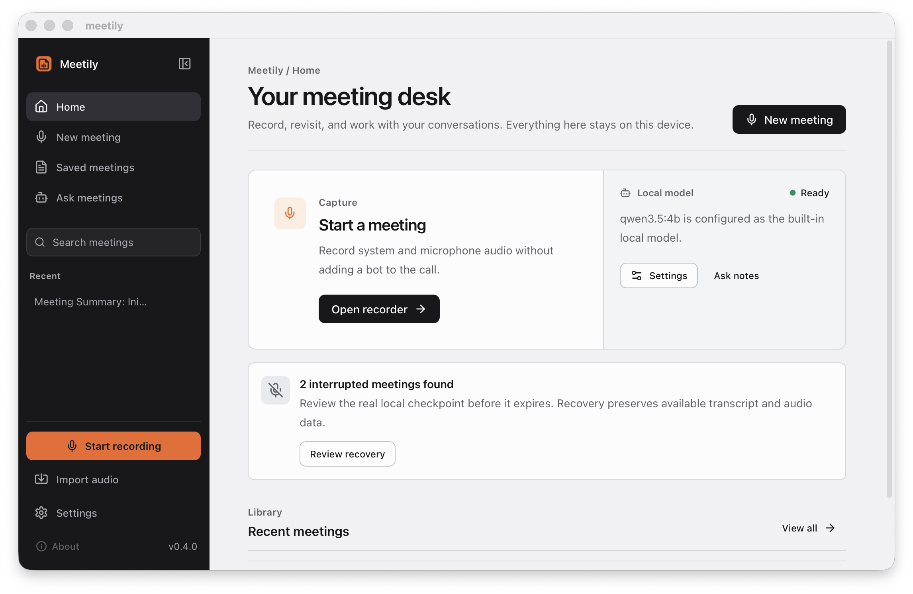

# Meetily Improved

### A calmer, local-first desktop meeting workspace for solo founders.

[](LICENSE)
[](#build-from-source)
[](#project-status)

**Meetily Improved** is an independent public fork of [Zackriya-Solutions/meetily](https://github.com/Zackriya-Solutions/meetily). It keeps Meetily's local capture, transcription, summaries, imports, recovery, and saved-meeting foundation while rebuilding the experience as a focused desktop workspace.

This fork is for people who want meeting software that feels considered without requiring a meeting bot, an account, or cloud storage. Core meeting data stays on your machine. Local AI is supported; optional remote summary providers remain explicit choices.

> The project is under active development. There is no supported Meetily Improved release yet. Build from source to try the current work.

## What this fork improves

The upstream project is capable, but its interface feels like a collection of utility screens. Meetily Improved is turning that foundation into one coherent workflow:

- **Desktop workspace instead of scattered screens.** A persistent sidebar, stable route frame, and reusable surfaces keep recording, meetings, recall, and settings in one place.
- **A useful home command center.** The dashboard reflects real local meetings, recovery state, and model configuration—never sample metrics or invented activity.
- **Clearer recording readiness.** Capture dependencies, permissions, local transcription readiness, and optional system audio are explained before recording begins.
- **Truthful local-first states.** Loading, empty, error, permission, recovery, and model states say what the app knows and what the user can do next.
- **Better information density.** A graphite tool rail, cool document canvas, compact controls, restrained signal orange, and keyboard-visible states keep attention on the meeting.
- **Local meeting recall, built honestly.** A global meeting-chat workspace is planned around local models and source meeting citations. It will not be called complete until the native bridge and citation behavior are implemented and tested.

## Current workspace



The screenshot above is the current native desktop shell using real local application state. It contains no sample meetings, fake metrics, or generated results.

## Project status

| Area | Status | What that means |
| --- | --- | --- |
| Repository and behavior audit | Complete | Routes, native command boundaries, storage, privacy, and upstream attribution are mapped. |
| Desktop shell and design system | In progress | The replacement graphite/cool-canvas shell and shared primitives are implemented; remaining routes are being migrated out of inherited Meetily styling. |
| Capture and meeting lifecycle | In progress | Pre-recording, active recording, processing, import, recovery, and failure presentation are being redesigned without replacing native capture behavior. |
| Meeting history and detail | Planned for v1 | Search, transcript/summary hierarchy, copy/export, and partial-data states will be rebuilt next. |
| Local global chat | Planned for v1 | Answers must use a local model and cite saved meetings. No persistent embeddings or cloud fallback are claimed. |
| Packaging and release QA | Not started | A public release waits on clean-checkout, packaging, and end-to-end verification. |

The execution plan is tracked in Linear and repository history as the project develops. A feature is only moved to complete after implementation, verification, and evidence.

## Existing Meetily capabilities preserved

Meetily Improved continues to preserve the working upstream foundation:

- Microphone and system-audio recording
- Live local transcription with Whisper or Parakeet
- Local recordings, transcripts, and SQLite meeting storage
- Saved-meeting history and detail views
- AI summaries with built-in local AI or Ollama
- Optional configured OpenAI, Anthropic, Groq, OpenRouter, remote Ollama, and OpenAI-compatible providers
- Audio import and re-transcription
- Interrupted-transcript recovery
- Model, recording, notification, and privacy settings
- macOS, Windows, and Linux source support inherited from upstream

## Privacy boundary

The default meeting workflow is local-first:

- Recordings and transcripts are stored on your device.
- Whisper, Parakeet, built-in AI, and local Ollama can run without sending meeting content to a cloud provider.
- The local meeting database and recovery checkpoints remain on the machine.
- Analytics is off by default and can be enabled or disabled in Settings.

If you explicitly configure a remote summary provider or a remote Ollama endpoint, the content required for that request is sent to that provider. Meetily Improved does not describe those paths as local.

There is no cloud sync, account system, calendar integration, or persistent embedding index in v1.

## Build from source

### Prerequisites

- [Node.js](https://nodejs.org/) and [pnpm](https://pnpm.io/)
- [Rust](https://rustup.rs/)
- Platform dependencies from the upstream [build guide](docs/BUILDING.md)

### Install and run the frontend

```bash
git clone https://github.com/henryvn27/meetily_improved.git
cd meetily_improved/frontend
pnpm install --frozen-lockfile
pnpm run dev
```

### Run the desktop app

Meetily uses a Rust helper sidecar. Build it once, then launch Tauri:

```bash
cd meetily_improved
cargo build --release -p llama-helper
cd frontend
pnpm run tauri:dev
```

GPU-specific and platform packaging details remain documented in [docs/BUILDING.md](docs/BUILDING.md).

## Architecture

Meetily Improved keeps the upstream Tauri architecture:

- **Frontend:** Next.js 14, React, TypeScript, Tailwind CSS
- **Desktop/native boundary:** Tauri 2
- **Capture and application services:** Rust
- **Local persistence:** SQLite, local recording folders, and IndexedDB recovery metadata
- **Local AI:** built-in models and Ollama

The redesign preserves native recording and transcription command contracts instead of replacing them with simulated frontend behavior. See [docs/architecture.md](docs/architecture.md) for the upstream architecture overview.

## Product boundaries

### v1

- Desktop-only interface redesign
- Reliable recording and import lifecycle presentation
- Searchable saved meetings and improved meeting detail workspace
- Local-model meeting chat with meeting citations
- Settings, privacy guidance, packaging, and release QA

### Later

- Note-first meeting workflow
- Editable AI-enhanced notes
- Local calendar context and pre-meeting briefs
- Persistent local retrieval index
- Deeper source and provenance inspection

These later ideas are backlog, not current functionality.

## Contributing

Issues and pull requests are welcome. Please read [CONTRIBUTING.md](CONTRIBUTING.md) and keep changes aligned with the project's core constraints:

- Preserve existing Meetily behavior unless a change explicitly replaces it.
- Keep meeting data local by default.
- Do not add fake meetings, AI answers, metrics, progress, or citations.
- Do not copy Granola assets, copy, protected UI, or proprietary implementation.
- Include tests or concrete verification for behavior changes.

## Fork, license, and attribution

Meetily Improved is built from [Zackriya-Solutions/meetily](https://github.com/Zackriya-Solutions/meetily). Zackriya Solutions created the original Meetily application and its capture, transcription, storage, summarization, import, and recovery foundation.

This fork is independently maintained and is not affiliated with Granola. Granola is a product-quality reference only; this project uses its own implementation, visual system, copy, and assets.

The project remains licensed under the [MIT License](LICENSE). The upstream copyright notice is preserved:

> Copyright (c) 2024 Zackriya Solutions

Third-party components remain subject to their own licenses. Upstream acknowledgments include [whisper.cpp](https://github.com/ggerganov/whisper.cpp), [Screenpipe](https://github.com/mediar-ai/screenpipe), [transcribe-rs](https://crates.io/crates/transcribe-rs), NVIDIA's Parakeet model, and the [ONNX Parakeet conversion by istupakov](https://huggingface.co/istupakov/parakeet-tdt-0.6b-v3-onnx).
